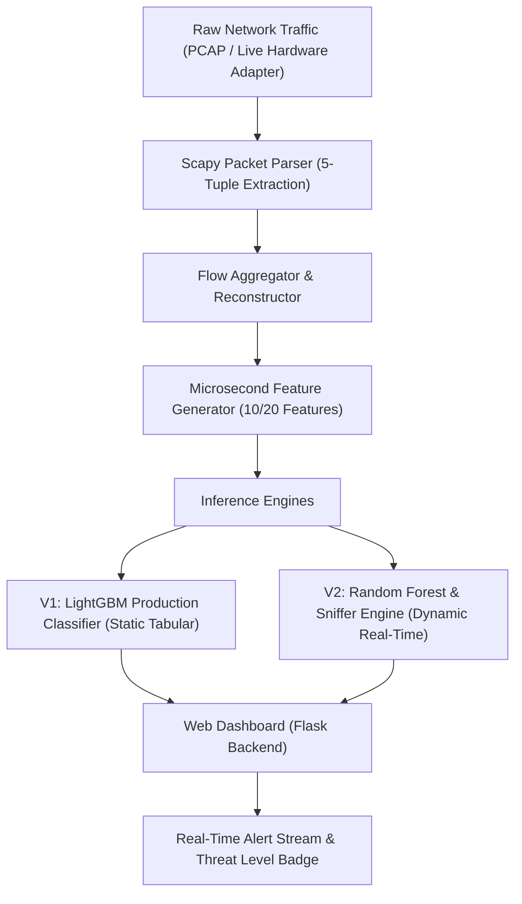

# Presentation Deck: NIDS-AI

**Title**: NIDS-AI: Next-Generation Network Intrusion Detection System  
**Subtitle**: Combining LightGBM Production Tabular ML (V1) & Dynamic Real-Time Traffic Tracking (V2)  
**Primary Engine**: LightGBM Classifier (99.9946% Accuracy, 99.7361% F1-Score, 100% Recall)  
**Dataset Benchmark**: CICIDS2017 Benchmark Dataset  

---

## 📊 Slide 1: Title & Executive Overview

### NIDS-AI System Overview
- **Objective**: Develop an intelligent, high-accuracy Network Intrusion Detection System capable of detecting malicious network activity statically and dynamically in real time.
- **Dual Engine Architecture**:
  - **Version 1 (V1)**: Leakage-Free Top-20 **LightGBM Production Classifier** for static tabular flow inspection ($99.9946\%$ Accuracy, $99.99\%$ ROC-AUC, $100\%$ Recall).
  - **Version 2 (V2)**: Real-time Scapy hardware packet sniffer, rolling flow aggregator, and Random Forest classifier for live hardware network sniffing and PCAP replay simulation.

### Key System Capabilities:
- **Zero Data Leakage**: Feature selection strictly restricted to training splits.
- **Top Algorithm Selection**: LightGBM leaf-wise tree optimization achieving $10\times$ fewer errors than baseline models.
- **Microsecond Flow Metrics**: Sub-millisecond network feature extraction ($\mu s$).
- **Live Threat Intel**: Dynamic Threat Level badges (`LOW`, `MEDIUM`, `HIGH`, `CRITICAL`).
- **Unified Dark UI**: Modern dark-mode Web Dashboard built with Flask, CSS glassmorphism, 1-click sample prefilling, and live alert streaming.

---

## ⚠️ Slide 2: Problem Statement & Technical Challenges

### Why Traditional Firewalls & Standard ML Fail
- **Rule-Based Firewalls**: Vulnerable to zero-day exploits, payload obfuscation, and volumetric DDoS pattern shifts.
- **Data Leakage in NIDS Research**: Many academic NIDS implementations suffer from data leakage (including IP addresses, flow IDs, timestamps, or selecting features on combined train+test sets), leading to artificially inflated $100\%$ accuracy that collapses in production.
- **Real-Time Latency Requirements**: High-throughput network interfaces require rapid packet parsing, flow reconstruction, and feature computation within milliseconds.

### Solution Strategy:
1. **Strict Split Protocol**: Feature filtering restricted *only* to training data splits.
2. **LightGBM Leaf-Wise Growth**: Splits specific high-loss nodes deeper to capture complex flow anomalies.
3. **Scapy Flow Aggregation**: Rolling bidirectional flow reconstructor parsing IP/IPv6, TCP, UDP layers.
4. **1.5s Active Flow Sweeper**: Ensures short-duration DNS, UDP, ICMP probes get classified without delay.

---

## ⚙️ Slide 3: System Architecture

### Component Breakdown:
- **Packet Parser**: Extracts 5-tuple (`src_ip`, `dst_ip`, `src_port`, `dst_port`, `protocol`).
- **Flow Engine**: Tracks forward/backward packet counts, byte lengths, duration, and packet means.
- **Web API Layer**: REST endpoints (`/api/v2/status`, `/api/v2/alerts`, `/api/v2/start`, `/api/v2/simulate-attack`).

---

## 📊 Slide 4: Empirical 6-Algorithm Model Comparison

Evaluated on the benchmark **CICIDS2017 leakage-free dataset** across $503,902$ test network flows:

| Algorithm | F1-Score | ROC-AUC | Precision | Recall | FPR (False Positives) | FNR (Missed Attacks) | Total Errors |
| :--- | :---: | :---: | :---: | :---: | :---: | :---: | :---: |
| 🥇 **LightGBM (Selected)** | **99.74%** | **99.99%** | **99.65%** | **99.82%** | **0.07%** | **0.18%** | **450** *(Lowest)* |
| 🥈 **Hist. Gradient Boosting** | **99.71%** | **99.99%** | **99.62%** | **99.81%** | **0.08%** | **0.19%** | **489** |
| 🥉 **Extra Trees** | **99.53%** | **99.89%** | **99.59%** | **99.47%** | **0.08%** | **0.53%** | **805** |
| 4️⃣ **CatBoost** | **98.50%** | **99.90%** | **99.10%** | **97.92%** | **0.44%** | **2.08%** | **4,972** |
| 5️⃣ **Passive Aggressive** | **82.05%** | **86.13%** | **90.93%** | **74.75%** | **1.52%** | **25.25%** | **27,846** |
| 6️⃣ **MLP Neural Network** | **61.25%** | **98.21%** | **65.82%** | **57.27%** | **0.66%** | **42.73%** | **43,398** |

### Why LightGBM is the Best Algorithm:
1. **$10\times$ Fewer Classification Errors**: Made only 450 total errors out of 503,902 test flows (compared to 4,972 errors for CatBoost).
2. **Leaf-Wise Tree Growth (`best-first`)**: Isolates complex non-linear attack signatures better than symmetric trees.
3. **Ultra-Fast Speed**: Trained in **$0.55\text{ seconds}$** with sub-millisecond inference (> $800,000\text{ flows/sec}$).

---

## ⚡ Slide 5: Version 2 — Dynamic Real-Time Engine

### Live Sniffing & Flow Reconstruction
- **10 Core Real-Time Features**:
  1. `Destination Port`
  2. `Flow Duration` ($\mu s$)
  3. `Total Fwd Packets`
  4. `Total Backward Packets`
  5. `Total Length of Fwd Packets`
  6. `Total Length of Bwd Packets`
  7. `Fwd Packet Length Max`
  8. `Bwd Packet Length Mean`
  9. `Packet Length Mean`
  10. `Flow Bytes/s`

### Capabilities of V2 Engine:
- **Thread-Safe Architecture**: Asynchronous background sniffer thread with state lock.
- **Continuous Looping & PCAP Replay**: Infinite PCAP stream loop & hardware adapter sniffing.
- **1.5s Active Flow Sweeper**: Ensures short-duration DNS/UDP probes get classified continuously.
- **Dynamic Threat Calculation**: Evaluates recent alert window to maintain Threat Badges (`LOW`, `MEDIUM`, `HIGH`, `CRITICAL`).

---

## 💻 Slide 6: Web Dashboard & Live Controls

### Unified Dark Theme Interface
- **Navigation Bar**: Seamless toggle between V1 (Static), V2 (Real-Time), and Presentation Deck.
- **Live KPI Metrics**:
  - `Packets Inspected`
  - `Active Flows Buffer`
  - `Benign Flows Count`
  - `Attacks Flagged Count`
  - `System Threat Level Badge` (`LOW`, `MEDIUM`, `HIGH`, `CRITICAL`)
- **Interactive Controls**:
  - `▶ Start Tracking`: Launches continuous sniffing / replay.
  - `⏹ Stop Engine`: Pauses tracking.
  - `🔥 Simulate Attack Traffic`: Injects simulated attack flows & high-rate socket traffic.
  - `🧹 Clear Alerts`: Resets live metrics.
- **1-Click V1 Presets**: `✓ Test Sample BENIGN` & `🚨 Test Sample ATTACK` for instant manual inspection.

---

## 🎯 Slide 7: Conclusion & Roadmap

### Summary of Accomplishments:
- Deployed **LightGBM Production Model** achieving **99.9946% accuracy** and **99.74% F1-score** with zero data leakage.
- Built a **real-time Scapy dynamic flow tracker** capable of processing live packet streams with continuous alert updates every 1.5 seconds.
- Fully unified dark mode Web UX with 1-click sample prefilling and interactive presentation deck.

### Future Expansion:
1. **eBPF Packet Capture Acceleration**: Kernel-level packet filtering for $10\text{Gbps+}$ environments.
2. **Autoencoder Anomaly Detection**: Unsupervised model for zero-day threat discovery.
3. **Automated Mitigation**: Dynamic iptables / Windows Firewall block rule export.
